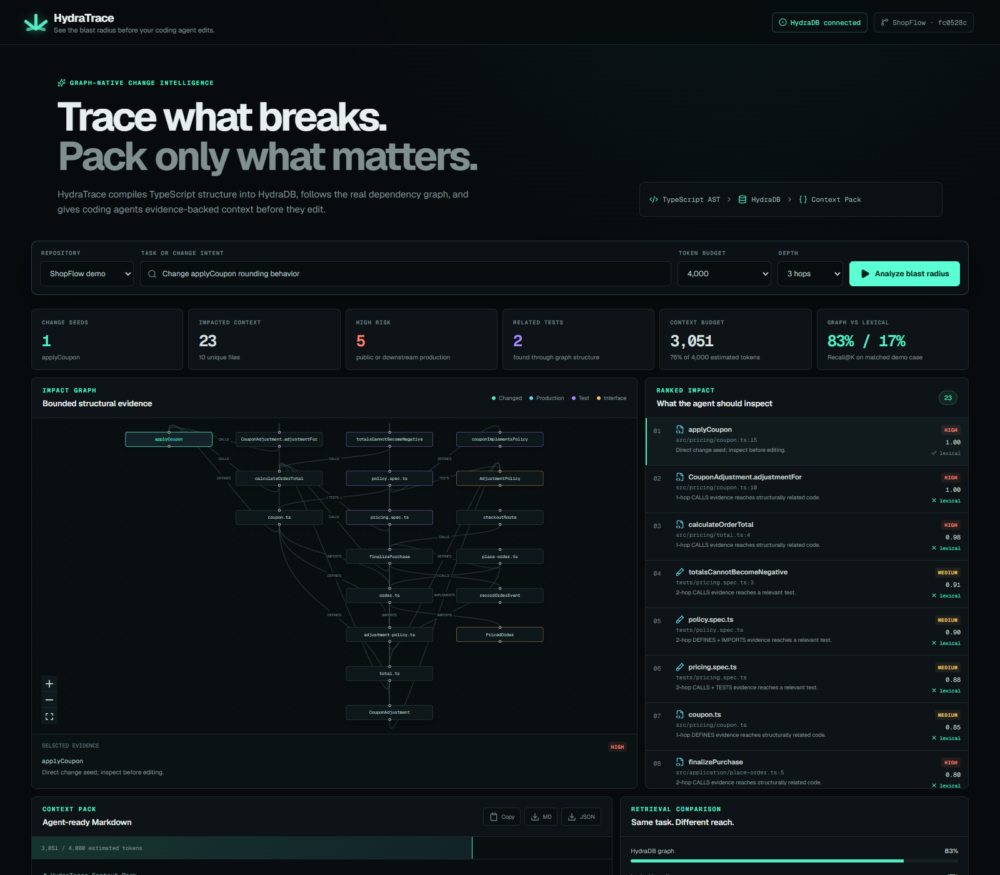
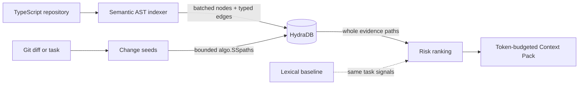

# HydraTrace

> **See the blast radius before your coding agent edits.**

HydraTrace is a graph-native change-impact and context compiler. It maps a TypeScript repository into HydraDB, traces the multi-hop blast radius of a diff or task, and emits an evidence-backed Context Pack sized for a coding agent’s token budget.

Filename search can find `applyCoupon`. HydraTrace also finds the aliased pricing caller, the purchase service, the checkout route, and tests that never mention coupons—and shows the graph path proving every result.



## Run the complete demo

Prerequisites: Node.js 22+, pnpm 11+, Git, Docker with Compose, and ports `7687`, `8443`, and `9090` available.

```bash
pnpm install
pnpm demo
```

`pnpm demo` creates a gitignored local token, starts the official HydraDB image, waits for readiness, proves an authenticated write/read, indexes ShopFlow, verifies multi-hop impact and Context Pack exports, and starts the web app. Open the printed local URL and click **Analyze blast radius**.

If port `3000` is occupied, Next.js prints the alternate port it selected. Stop without deleting graph data with `Ctrl+C`; stop HydraDB with `pnpm hydra:down`.

## What happens in 60 seconds

1. The ts-morph indexer resolves internal imports, calls, inheritance, implementations, and test dependencies.
2. Deterministic safe-integer nodes and typed edges are upserted into HydraDB in `UNWIND` batches.
3. A diff line or task token selects bounded, auditable change seeds.
4. Native `algo.SSpaths` traversal returns whole one-to-three-hop paths from HydraDB.
5. A deterministic score ranks production callers, contracts, and tests.
6. The Context Pack hydrates only those returned IDs with bounded local snippets, staying within 2K, 4K, or 8K estimated tokens.



## Why HydraDB is essential

The source cache stores bounded metadata and hydrates snippets only after HydraDB returns relevant node IDs. It cannot traverse or determine impact.

**Without HydraDB, HydraTrace loses its core blast-radius traversal and evidence paths. The local source cache can hydrate snippets but cannot determine impact. There is intentionally no production fallback graph.**

HydraTrace uses HydraDB for real batched storage, causal bookmarks, typed path decoding, native whole-path traversal, and live execution receipts. If HydraDB is unavailable or rejects a query, indexing and analysis fail visibly.

## Graph model

Nodes are `Repository`, `File`, `Symbol`, and `ChangeSet`. Relationships are `CONTAINS`, `DEFINES`, `IMPORTS`, `CALLS`, `EXTENDS`, `IMPLEMENTS`, `TESTS`, and `TOUCHES`. Repository-scoped canonical keys hash into non-negative IDs below `2^52`, with collision detection. See [the graph model](docs/GRAPH_MODEL.md).

## Executed fixture benchmark

`pnpm benchmark` runs seven gold-labeled ShopFlow cases against the same task signals. It calculates every metric from current results and writes JSON/Markdown under ignored `generated/benchmark`; the committed [executed report](docs/BENCHMARK_RESULTS.md) is generated by the same command.

| Retrieval | Macro Recall@K | Macro Precision@K |
|---|---:|---:|
| Lexical baseline | 0.429 | 0.905 |
| HydraDB graph | 0.952 | 0.569 |

The graph retrieves far more structurally relevant files, while the narrower lexical result set is more precise. The local-config case ties, preserving a case where graph expansion adds no value. This synthetic fixture demonstrates product behavior; it is not a claim about general repository performance. See [methodology](docs/BENCHMARK.md) and [executed results](docs/BENCHMARK_RESULTS.md).

## Five-minute setup, step by step

```bash
pnpm install
pnpm hydra:prepare
pnpm hydra:up
pnpm hydra:wait
pnpm hydra:smoke
pnpm demo:index
pnpm demo:analyze
pnpm dev
```

The official container is `ghcr.io/hydra-db/hydradb:latest`; the verified local image during the committed benchmark resolved to `sha256:db78309a233be54662db29744047e985a39b51c45a270d1a1f47c31a62cdb709`. `latest` is convenient for judging; pin that digest for a frozen environment.

Local defaults are listed in [.env.example](.env.example). The generated token stays at `.hydratrace/secrets/hydradb-token`, which is ignored. Do not commit it. Docker uses a named volume and an init container that creates writable store/cache paths for HydraDB’s UID `10001`.

## CLI

```bash
pnpm cli --help
pnpm cli doctor fixtures/shopflow
pnpm cli index /path/to/typescript-repo
pnpm cli analyze /path/to/repo --base HEAD^ --head HEAD --budget 4000
pnpm cli analyze /path/to/repo --task "Change applyCoupon rounding behavior" --depth 3 --json
pnpm benchmark
```

Diff mode uses read-only `git diff --unified=0 --find-renames`. Added, modified, renamed, and deleted files are represented honestly; Context Packs record base/head refs and bounded diff hunks before graph-expanded source context. Task mode deterministically ranks exact names, qualified names, quoted text, paths, and token overlap; low-confidence seeds are labelled rather than overstated. Diff seeds outrank task seeds when both are supplied.

## Verification

```bash
pnpm lint
pnpm typecheck
pnpm test
pnpm test:integration
pnpm build
pnpm benchmark
pnpm demo:verify
```

Live integration tests cover authenticated write/read, bookmarks, batched idempotent upserts, native paths, malformed queries, invalid authentication, and the explicit no-fallback failure. CI runs the same checks with the official container.

## Security and honest boundaries

- The web API only indexes the bundled ShopFlow fixture; it does not accept arbitrary filesystem paths.
- Source hydration resolves real paths and rejects anything outside the requested repository root. Symlinks are excluded during discovery.
- Task text never enters Cypher; all values are parameterized and labels/types come from fixed enums.
- Bearer tokens are file-backed, gitignored, and redacted from errors.
- TypeScript and JavaScript only. Static analysis can miss dynamic dispatch, reflection, runtime module loading, and ambiguous overloads.
- Traversal is deliberately bounded to three hops and 100 paths per seed.
- Upserts are idempotent, but this hackathon build does not garbage-collect stale graph records after files are removed.
- Deleted files may map only to a file-level seed when their prior symbol metadata is unavailable.
- Token counts use the documented characters-divided-by-four estimate.

## Hackathon and attribution

Built for **Hack Hydra 2026**, Track 02: **Repos, dependencies and code as graphs**, sub-track B: **Code graphs for IDE assistants**. The implementation follows HydraDB’s current [README](https://github.com/hydra-db/hydradb/blob/main/README.md), [architecture](https://github.com/hydra-db/hydradb/blob/main/architecture.md), [Cypher compatibility guide](https://github.com/hydra-db/hydradb/blob/main/cypher-compat.md), and [agent guidance](https://github.com/hydra-db/hydradb/blob/main/AGENTS.md). See [third-party notices](THIRD_PARTY_NOTICES.md).

MIT licensed. See [LICENSE](LICENSE).
