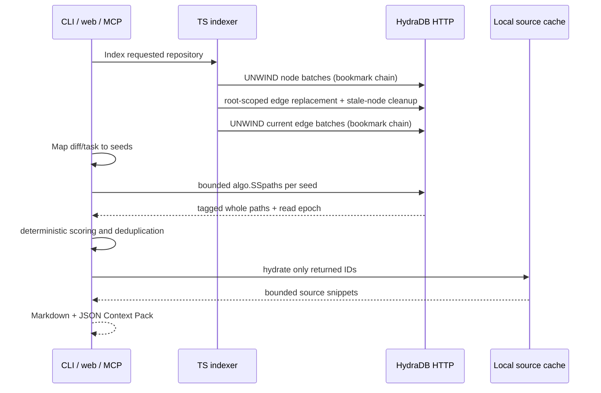

# HydraTrace architecture

## Product boundary

HydraTrace is one strict TypeScript application with four runtime stages: static indexing, HydraDB storage, graph-native impact retrieval, and local context hydration. Next.js, the CLI, and the stdio MCP server call the same core service, so neither the demo nor the agent integration has a separate or fake data path.

## Components

| Component | Responsibility |
|---|---|
| `src/core/indexer` | Safe discovery and ts-morph semantic extraction. |
| `src/core/diff` / `baseline` | Read-only Git hunk mapping and deterministic task signals. |
| `src/hydradb` | Configuration, typed HTTP values, retries, bookmarks, pagination, queries, ingestion. |
| `src/core/impact` | Native traversal orchestration, evidence orientation, ranking. |
| `src/core/context` | Root-confined snippet hydration, deduplication, budget enforcement. |
| `src/core/service` | Shared vertical slice used by CLI and web. |
| `src/app` | Live-only desktop demo; the API resolves only ShopFlow and HydraTrace from a server-owned registry. |
| `src/mcp` | Compact stdio tools returning the same Context Pack and structured evidence to coding agents. |
| `src/benchmark` | Reproducible fixture evaluation and generated reports. |

## Storage and consistency

Every mutation response bookmark is retained by `HydraDbClient`. Subsequent batches and reads send that bookmark with causal consistency. Cursor pages reuse the query ID, query, parameters, target, principal, initial bookmark, and latest opaque cursor. Strong consistency is supported by the typed client but the local single-node workflow uses causal reads after its writes.

Index synchronization is intentionally repairable across separate HydraDB statements. HydraTrace first upserts the current nodes, counts and deletes each repository-scoped relationship type, removes stale nodes discovered by label and root hash, and then upserts the current relationships. The resulting graph is idempotent even when files disappear. Mutation query IDs include a per-run nonce because HydraDB deduplicates a repeated `query_id`; retries inside one HTTP operation still retain one ID. A failure can leave a partial update because the HTTP API has no cross-request transaction, but the next successful index reconstructs the repository graph.

HydraDB remains correct without a separately running graph-indexer worker: current reads combine compiled traversal topology with the visible WAL overlay or canonical adjacency. The demo therefore runs the official `graph-node` only. This is an explicit documented HydraDB architecture property, not a local fallback.

## Failure behavior

- Admin readiness is a preliminary check; only `pnpm hydra:smoke` proves execution.
- HTTP 429 and 503 receive two bounded backoff retries with the same query ID.
- Invalid queries, authentication failures, timeouts, and all other responses fail immediately with sanitized context.
- Pagination column drift fails rather than merging corrupt pages.
- Invalid configuration, an unavailable token file, unsafe paths, missing seeds, or HydraDB unavailability are user-visible errors.
- There is no production in-memory, JSON, SQLite, Kuzu, or Neo4j traversal.

## Security boundaries

The CLI and local MCP server accept a repository path, canonicalize it, skip symlinks, ignore build/cache/binary content, and use `execFile` argument arrays for read-only Git commands. Snippet hydration rechecks both requested and real paths. The browser never receives the bearer token and its API route accepts only IDs from a two-entry server-owned registry. User task text stays in local lexical matching and cannot alter Cypher syntax. Graph labels and relationship types are compiled from closed TypeScript unions. MCP is a local trust boundary and runs with the invoking user’s filesystem permissions.

**Without HydraDB, HydraTrace loses its core blast-radius traversal and evidence paths. The local source cache can hydrate snippets but cannot determine impact. There is intentionally no production fallback graph.**
