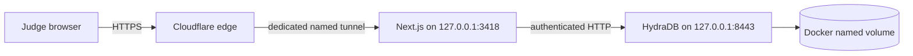

# Public demo deployment

The live judge experience is available at [hydratrace.tangvu.dev](https://hydratrace.tangvu.dev). It is intentionally self-hosted: the product needs a persistent HydraDB container, its named volume, and read-only access to the registered source repositories. Moving only the Next.js shell to a serverless host would split the product across two origins without removing the workstation dependency.

## Runtime boundary



Only Next.js port `3418` is published through the tunnel. HydraDB Bolt, HTTP, and admin ports remain bound to `127.0.0.1` at `7687`, `8443`, and `9090`. The browser API resolves only `shopflow` and `hydratrace`; request data never becomes a filesystem path. Public analysis is limited to one active run and six accepted runs per five-minute client window. Workstation-specific absolute paths are removed from web responses.

## Local process supervision

Two Windows Scheduled Tasks run at owner logon and restart up to 99 times at one-minute intervals after a failure:

- `HydraTrace-App` runs [`scripts/windows/run-production.ps1`](../scripts/windows/run-production.ps1), starts HydraDB idempotently, waits for real readiness, and serves the production build on loopback.
- `HydraTrace-Tunnel` runs [`scripts/windows/run-tunnel.ps1`](../scripts/windows/run-tunnel.ps1) with the dedicated, uncommitted Cloudflare configuration in `%USERPROFILE%\.cloudflared\hydratrace.yml`.

Tunnel credentials live outside the repository. Never commit the Cloudflare credential JSON, the HydraDB bearer-token file, `.env` files, or generated deployment logs.

## Preflight and health checks

Run before recording or judging:

```powershell
pnpm hydra:smoke
Invoke-RestMethod https://hydratrace.tangvu.dev/api/status
Get-ScheduledTask -TaskName "HydraTrace-*" | Select-Object TaskName, State
```

A healthy status response has `ok: true` and `authenticated: true`. A port opening alone is not accepted as HydraDB readiness. The complete product path is verified with the default ShopFlow task in the web interface or `pnpm demo:verify` locally.

## Deploying a new build

```powershell
pnpm lint
pnpm typecheck
pnpm test
pnpm build
Stop-ScheduledTask -TaskName HydraTrace-App
Start-ScheduledTask -TaskName HydraTrace-App
Invoke-RestMethod https://hydratrace.tangvu.dev/api/status
```

Cloudflare DNS and the tunnel do not need to change for an application release. If the public URL fails while localhost is healthy, inspect the `HydraTrace-Tunnel` task and the newest ignored `generated/deploy/tunnel-*.log`. If localhost also fails, inspect `HydraTrace-App` and `generated/deploy/app-*.log`, then run `pnpm hydra:smoke` to separate application and database failures.

## Operational limitations

- The public demo depends on workstation power, network, Docker Desktop, and owner logon. The recorded demo remains the fallback artifact.
- The in-process rate limiter is appropriate for this single-instance judge demo, not a distributed service.
- The public hostname intentionally has no Cloudflare Access login so judges can open it directly.
- HydraDB itself is never exposed publicly, and there is no production fallback database.
